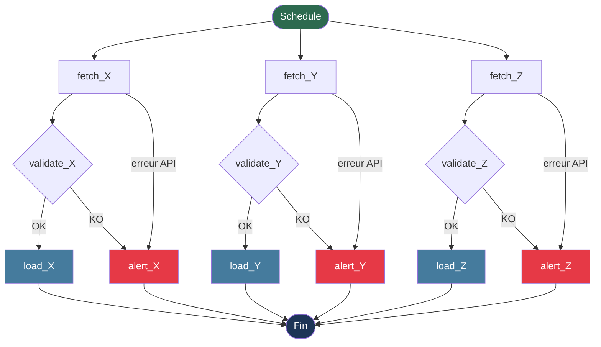

# TP 1  Modeliser un pipeline meteo avant de coder

## 1. etapes du pipeline

- Fetch : Appel à l'API meteo
- Validate : Verification de la completude et coherence des donnees reçues
- Load : Insertion des donnees valides en base
- Alert : Notification en cas d'echec ou de donnees incompletes

---

## 2. Decoupage en taches

- `fetch_X` : Appel HTTP à l'API meteo
- `validate_X` : Verifie la presence et la coherence des champs critiques
- `load_X` : Insere les donnees validees en base
- `alert_X` : Envoie une alerte en cas d'echec

---

## 3. Dependances entre les taches

```
fetch_X  →  validate_X  →  load_X
                        ↘
                     alert_X  (si validate KO)

fetch_X  →  alert_X           (si erreur API)
```

- `validate_X` ne peut demarrer qu'apres `fetch_X`
- `load_X` ne demarre que si `validate_X` est en succes
- `alert_X` est declenche si `fetch_X` echoue ou si `validate_X` echoue

---

## 4. Taches parallelisables

Les triplets `(fetch, validate, load)` sont entierement paralleles entre les differentes sources, sans dependance entre elles.

```
START ──┬── fetch_X ──── validate_X ──── load_X
        ├── fetch_Y ──── validate_Y ──── load_Y
        └── fetch_Z ──── validate_Z ──── load_Z
```

A l'interieur d'une même source, les 3 taches restent sequentielles.

---

## 5. Schema du DAG



Les branches demarrent simultanement. Un echec sur une source ne bloque pas les autres.

---

## 6. Que se passe-t-il si l'appel API echoue 

1. Retry automatique : la tache `fetch_X` est relancee automatiquement.
2. echec definitif : apres epuisement des retries, la tache passe en etat `FAILED`.
3. Les taches aval sont skippees : `validate_X` et `load_X` ne demarrent pas.
4. `alert_X` est declenche avec l'heure et le message d'erreur.
5. Pas de modification en base : les donnees precedentes restent intactes.
6. Traçabilite : l'echec est loggue avec timestamp, code HTTP et stacktrace.

---

## 7. Que se passe-t-il si les donnees recuperees sont incompletes 

L'API a bien repondu mais des champs obligatoires sont absents ou incoherents.

1. `fetch_X` reussit : la reponse HTTP est 200 mais le contenu est partiel.
2. `validate_X` detecte l'anomalie en controlant la presence et le format des champs critiques.
3. `validate_X` bascule sur le chemin KO : `load_X` est ignore pour eviter d'inserer des donnees corrompues.
4. `alert_X` est declenche avec le detail des champs manquants ou invalides.
5. Pas de rollback necessaire : rien n'a ete ecrit en base.
6. On peut distinguer des niveaux de severite : un champ secondaire manquant ne bloque pas le chargement, contrairement à un champ critique.
